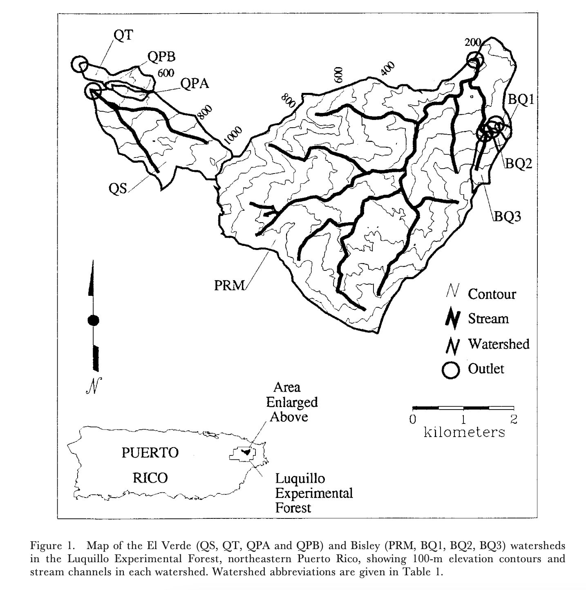

## Stream chemistry changes in Puerto Rico before and after Hurricane Hugo


### Background
This project takes data on nutrient concentrations in several streams in the Luquillo experimental forest in Puerto Rico between 1988 and 1994.  The purpose is to analyze changes over time in these  nutrient concentrations before and after 1989's hurricane by generating nutrient concentration time-series plots.

Our analysis is based on that of Schaefer, Douglas. A., William H. McDowell, Fredrick N. Scatena, and Clyde E. Asbury. 2000 (figure below)

{width=400}


### Data
CSV files from the Environmental Data Initiative and [McDowell, William H., and USDA Forest Service. International Institute Of Tropical Forestry (IITF). 2024.](https://doi.org/10.6073/PASTA/F31349BEBDC304F758718F4798D25458).  
Data downloaded and stored locally within the repository.

### Methods
Stream ion concentration readings were continously collected in the Luquillo forest between 1988 and 1994.  We downloaded data for four specific stream sites: BQ1, BQ2, BQ3, PRM (see below):

{width=600}

We then created a "moving average" function in order to calculate averages for the existing stream ion concentration data over 9-week windows.  Focusing specifically on the data for K, Ca, Mg, NH4-N, and NO3-N, these average values were merged into a larger dataset which was then plotted on year vs ion concentration axes, sorted by ion.

### Results
```{r}
#| echo: false
#| warning: false

library(tidyverse)
clean_comb_piv <- read_csv("../output/clean_combine_pivot.csv")
ggplot(
  data = clean_comb_piv,
  mapping = aes(
    x = window_start,
    y = concentration,
    linetype = Site
  )
) +
  theme_bw() +
  geom_line() +
  #combine all plots in one with labels on side using facet_grid
  facet_grid(
    #create factor to put facets in correct order
    vars(factor(
      nutrient,
      levels = c('K', 'NO3-N', 'Mg', 'Ca', 'NH4-N'),
      labels = c('K mg L', 'NO3-N ug L', 'Mg mg L', 'Ca mg L', 'NH4-N ug L')
    )),
    scales = "free_y",
    switch = "y",
  ) +
  #add line representing when the hurricane was
  geom_vline(xintercept = ymd("1989-09-17"), linetype = "dashed") +
  labs(
    title = "Stream Ion Concentrations in Luquillo, Puerto Rico From 1988 to 1994",
    x = "Year",
    y = "Stream Ion Concentration"
  )
```

This graph shows nutrient concentrations over time in the four stream sites between 1986 and 1995.  The figure contains one plot for each nutrient (Ca, Mg, K, NH4-N, and NO3-N).  Line types denote different sites.  The vertical dashed line in late 1989 repesents the timing of hurricane Hugo.  With the exception of NH4-N, ion concentrations appear to increase significantly after 1989's hurricane across all stream sites.